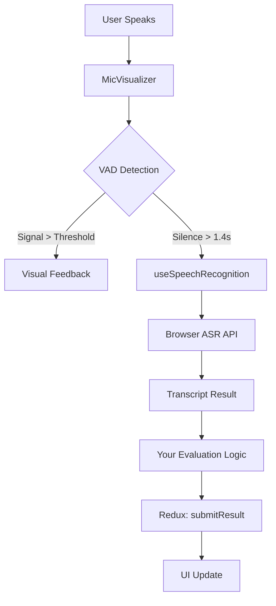

see the UUI# Integration Guide: VAD/ASR/Calibration System

This guide helps developers integrate the Voice Activity Detection (VAD), Automatic Speech Recognition (ASR), and Calibration system from this POC into their own products.

---

## 📋 **Quick Overview**

This POC demonstrates a **production-ready** speech recognition system with:
- **Smart Calibration**: Adapts to user's environment noise
- **Voice Activity Detection (VAD)**: Visual feedback when user is speaking
- **Optimized ASR**: Industry-standard timing (1.4s silence timeout)
- **Redux State Management**: Scalable, predictable state updates
- **Game Modes**: Flexible content filtering (Speaking/Quiz/Mix)

---

## 🎯 **Key Files to Integrate**

### **1. Core Speech Components**

| File | Purpose | Integration Priority |
|------|---------|---------------------|
| `src/components/MicVisualizer.jsx` | VAD + Visual feedback | ⭐⭐⭐ Essential |
| `src/hooks/useSpeechRecognition.js` | ASR wrapper hook | ⭐⭐⭐ Essential |
| `src/components/CalibrationScreen.jsx` | Noise calibration UI | ⭐⭐ Recommended |
| `src/utils/pronunciationEvaluator.js` | Transcript evaluation | ⭐ Optional |

### **2. State Management (Redux)**

| File | Purpose | Integration Priority |
|------|---------|---------------------|
| `src/store/gameSlice.js` | Game state + actions | ⭐⭐⭐ Essential |
| `src/store/index.js` | Redux store config | ⭐⭐⭐ Essential |

### **3. Configuration**

| File | Purpose | Integration Priority |
|------|---------|---------------------|
| `src/constants.js` | Activity data structure | ⭐⭐ Recommended |
| `src/theme.js` | Semantic color tokens | ⭐ Optional |

---

## 🔧 **Step-by-Step Integration**

### **Step 1: Install Dependencies**

```bash
npm install @reduxjs/toolkit react-redux framer-motion lucide-react
```

### **Step 2: Copy Core Files**

Copy these files to your project:

```
your-project/
├── src/
│   ├── components/
│   │   ├── MicVisualizer.jsx          # VAD + visualizer
│   │   └── CalibrationScreen.jsx      # Calibration UI
│   ├── hooks/
│   │   └── useSpeechRecognition.js    # ASR hook
│   ├── store/
│   │   ├── gameSlice.js               # Redux state
│   │   └── index.js                   # Store config
│   └── utils/
│       └── pronunciationEvaluator.js  # Optional: evaluation logic
```

### **Step 3: Setup Redux Store**

Wrap your app with the Redux Provider:

```jsx
// main.jsx or index.js
import { Provider } from 'react-redux';
import { store } from './store';

root.render(
  <Provider store={store}>
    <App />
  </Provider>
);
```

### **Step 4: Integrate VAD/ASR in Your Component**

```jsx
import { useCallback, useState } from 'react';
import { useDispatch, useSelector } from 'react-redux';
import MicVisualizer from './components/MicVisualizer';
import useSpeechRecognition from './hooks/useSpeechRecognition';
import { 
  selectDynamicThreshold, 
  submitResult, 
  setFeedback 
} from './store/gameSlice';

function YourComponent() {
  const dispatch = useDispatch();
  const dynamicThreshold = useSelector(selectDynamicThreshold);
  const [isSpeaking, setIsSpeaking] = useState(false);

  // Handle speech result
  const handleSpeechResult = useCallback((transcript) => {
    console.log('User said:', transcript);
    
    // Your evaluation logic here
    const isCorrect = evaluateAnswer(transcript);
    
    dispatch(submitResult({
      transcript,
      status: isCorrect ? 'correct' : 'incorrect',
    }));
  }, [dispatch]);

  // Handle no speech detected
  const handleNoSpeech = useCallback(() => {
    console.log('No speech detected');
    dispatch(setFeedback({
      message: 'No speech detected. Please try again.',
      type: 'warning',
    }));
  }, [dispatch]);

  // Initialize ASR hook
  const {
    isListening,
    startListening,
    stopListening,
    error: speechError,
  } = useSpeechRecognition({
    onResult: handleSpeechResult,
    onNoSpeech: handleNoSpeech,
    language: 'fr-FR', // Change to your target language
  });

  return (
    <div>
      {/* VAD Visualizer */}
      <MicVisualizer
        isListening={isListening}
        setIsSpeaking={setIsSpeaking}
        dynamicThreshold={dynamicThreshold}
        onSilence={stopListening}
      />

      {/* Start/Stop buttons */}
      <button onClick={startListening} disabled={isListening}>
        Start Listening
      </button>
      <button onClick={stopListening} disabled={!isListening}>
        Stop Listening
      </button>
    </div>
  );
}
```

### **Step 5: Add Calibration Flow**

```jsx
import CalibrationScreen from './components/CalibrationScreen';
import { setCalibrationComplete } from './store/gameSlice';

function YourApp() {
  const [needsCalibration, setNeedsCalibration] = useState(true);
  const dispatch = useDispatch();

  const handleCalibrationComplete = (threshold) => {
    dispatch(setCalibrationComplete(threshold));
    setNeedsCalibration(false);
  };

  if (needsCalibration) {
    return (
      <CalibrationScreen
        onComplete={handleCalibrationComplete}
        onSkip={() => setNeedsCalibration(false)}
      />
    );
  }

  return <YourComponent />;
}
```

---

## ⚙️ **Critical Configuration Values**

### **Timing Constants** (Optimized for Production)

```javascript
// In MicVisualizer.jsx
const VOICE_THRESHOLD = 30;           // Base threshold for speech detection
const SPEAKING_DEBOUNCE = 100;        // ms - Prevents UI flicker
const SILENCE_TIMEOUT = 1400;         // ms - Industry standard (Siri/Google)
const MIN_SPEECH_DURATION = 200;      // ms - Filters micro-spikes
const CALIBRATION_TIME = 2000;        // ms - Noise sampling duration
```

### **ASR Configuration**

```javascript
// In useSpeechRecognition.js
recognition.continuous = false;        // Stop after one result
recognition.interimResults = false;    // Only final results
recognition.maxAlternatives = 1;       // Single best guess
recognition.lang = 'fr-FR';            // Target language
```

---

## 🏗️ **Architecture Overview**



---

## 🎨 **Customization Tips**

### **1. Change Language**

```javascript
// In useSpeechRecognition.js
recognition.lang = 'en-US';  // English
recognition.lang = 'es-ES';  // Spanish
recognition.lang = 'de-DE';  // German
```

### **2. Adjust Sensitivity**

```javascript
// In MicVisualizer.jsx
const VOICE_THRESHOLD = 20;  // More sensitive (picks up quieter speech)
const VOICE_THRESHOLD = 40;  // Less sensitive (requires louder speech)
```

### **3. Customize Visualizer Colors**

```javascript
// In MicVisualizer.jsx
const [inactiveColor, readyColor, activeColor1, activeColor2] = useToken('colors', [
  'gray.300',    // Inactive bars
  'blue.400',    // Ready state
  'purple.500',  // Active gradient start
  'pink.500',    // Active gradient end
]);
```

---

## ✅ **Best Practices for Production**

### **1. Error Handling**

```javascript
// Always handle ASR errors
const { error } = useSpeechRecognition({...});

useEffect(() => {
  if (error) {
    console.error('ASR Error:', error);
    // Show user-friendly error message
    showToast('error', 'Microphone issue', error.message);
  }
}, [error]);
```

### **2. Permissions**

```javascript
// Request mic permissions early
useEffect(() => {
  navigator.mediaDevices.getUserMedia({ audio: true })
    .then(() => console.log('Mic access granted'))
    .catch((err) => console.error('Mic access denied:', err));
}, []);
```

### **3. Mobile Safari Support**

```javascript
// Resume AudioContext on user interaction (iOS requirement)
useEffect(() => {
  const resumeAudio = () => {
    const ctx = new (window.AudioContext || window.webkitAudioContext)();
    if (ctx.state === 'suspended') {
      ctx.resume();
    }
  };
  
  document.addEventListener('click', resumeAudio, { once: true });
}, []);
```

### **4. Memory Management**

```javascript
// Always cleanup audio nodes
useEffect(() => {
  return () => {
    if (sourceRef.current) {
      sourceRef.current.disconnect();
    }
    if (analyserRef.current) {
      analyserRef.current = null;
    }
  };
}, []);
```

---

## 🚀 **Testing Checklist**

- [ ] Test in Chrome, Safari, Firefox, Edge
- [ ] Test on iOS Safari (mobile)
- [ ] Test in quiet environment
- [ ] Test in noisy environment
- [ ] Test with different microphones
- [ ] Test calibration flow
- [ ] Test re-calibration on failure
- [ ] Test error handling (denied permissions)
- [ ] Test with different languages
- [ ] Verify no memory leaks (check DevTools)

---

## 📚 **Additional Resources**

- **DOCUMENT.md**: Full feature list and UX details
- **TECHNICAL_FLOW.md**: System architecture and data flow
- **ERROR_HANDLING.md**: All error codes and handling strategies
- **BEST_APPROACH_VERIFICATION.md**: VAD/ASR/Calibration implementation details

---

## 🆘 **Common Issues & Solutions**

### **Issue: "No speech detected" constantly**

**Solution**: Lower the `VOICE_THRESHOLD` or increase calibration time.

```javascript
const VOICE_THRESHOLD = 20;  // Lower = more sensitive
const CALIBRATION_TIME = 3000;  // Longer calibration
```

### **Issue: VAD triggers on background noise**

**Solution**: Increase the threshold margin or use longer MIN_SPEECH_DURATION.

```javascript
const VOICE_THRESHOLD = 40;  // Higher = less sensitive
const MIN_SPEECH_DURATION = 300;  // Longer validation
```

### **Issue: ASR doesn't work on iOS**

**Solution**: Ensure AudioContext is resumed on user interaction (see Mobile Safari Support above).

### **Issue: Visualizer bars don't animate**

**Solution**: Check that `isListening` prop is correctly passed and Framer Motion is installed.

---

## 💡 **Pro Tips**

1. **Use Redux DevTools** for debugging state changes
2. **Enable console logging** to track VAD/ASR flow (`[VAD]`, `[ASR]`, `[Game]` labels)
3. **Test calibration** in different environments (office, home, outdoors)
4. **Monitor performance** with React DevTools Profiler
5. **Use semantic tokens** for easy theming (Light/Dark mode)

---

**Ready to integrate? Start with Step 1 and follow the guide sequentially. Good luck! 🚀**

*For questions or issues, refer to the source code in this POC or contact the development team.*
