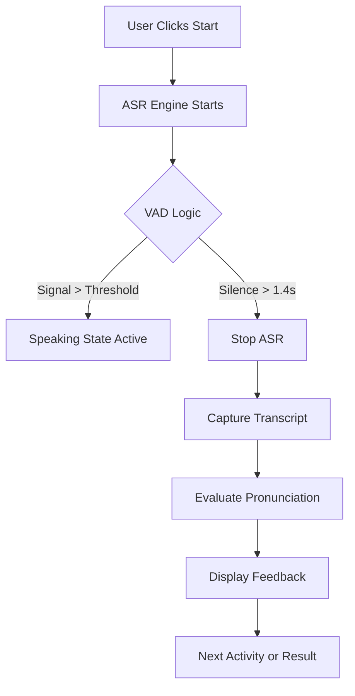

# Technical Flow & Architecture

This document details the internal logic and interaction flow of the French Months practice application.

## 1. System Components
The application is built on three main pillars:
1. **The Audio Graph (`MicVisualizer.jsx`)**: Handles raw PCM data from the microphone.
2. **The Speech Engine (`useSpeechRecognition.js`)**: Interfaces with the browser's native `SpeechRecognition` API.
3. **The Orchestrator (`App.jsx`)**: Manages game state and evaluates transcripts.

## 2. Interaction Lifecycle

### Phase A: Calibration
- **Trigger**: App start or repeated recognition failure.
- **Logic**: Samples 2.5 seconds of background noise to set a `dynamicThreshold`.
- **Purpose**: To distinguish between background hum and actual user speech.

### Phase B: Playing (The Game Loop)
1. **Idle**: Waiting for user to click "Start Practice".
2. **Listening**: `SpeechRecognition` is active.
3. **VAD Detection**: `MicVisualizer` detects signal > threshold and updates `isSpeaking` state.
4. **Capture**: System waits for **1.4s** of silence after speech before closing the ASR window.
5. **Evaluation**: Resulting transcript is processed via `pronunciationEvaluator.js`.

### Phase C: Results
- Final state aggregation and statistical display with performance animations.

## 3. Data Flow Diagram (Mermaid)

## 4. Key Implementation Details
- **Persistent Audio Nodes**: Audio sources and analysers are stored in `useRef` to prevent redundant processing and memory leaks.
- **State Debouncing**: Speaking transitions are debounced by 50ms to prevent UI flickering.
- **iOS Stability**: A global listener in `App.jsx` handles the explicit `AudioContext.resume()` required by mobile Safari.
