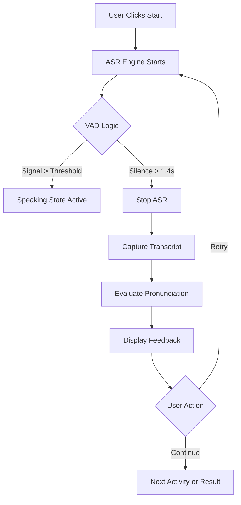

# Technical Flow & Architecture

This document details the internal logic and interaction flow of the French Months practice application.

## 1. System Components
The application is built on four main pillars:
1. **The Redux Store (`store/gameSlice.js`)**: Centralized state management with actions and memoized selectors.
2. **The Audio Graph (`MicVisualizer.jsx`)**: Handles raw PCM data from the microphone.
3. **The Speech Engine (`useSpeechRecognition.js`)**: Interfaces with the browser's native `SpeechRecognition` API.
4. **The Orchestrator (`App.jsx`)**: Dispatches Redux actions and coordinates component interactions.
5. **The Theme Manager (`theme.js`)**: Controls dynamic semantic tokens for Light/Dark mode consistency.

## 2. Interaction Lifecycle

### Phase A: Calibration
- **Trigger**: App start or repeated recognition failure.
- **Logic**: Samples 2.5 seconds of background noise to set a `dynamicThreshold`.
- **Purpose**: To distinguish between background hum and actual user speech.

### Phase B: Playing (The Game Loop)
1. **Mode Selection**: User chooses Mix, Speaking, or Quiz mode on StartScreen.
2. **Idle**: Waiting for user to click "Start Learning".
3. **Listening**: `SpeechRecognition` is active (Speaking mode only).
4. **VAD Detection**: `MicVisualizer` detects signal > threshold and updates `isSpeaking` state.
5. **Capture**: System waits for **1.4s** of silence after speech before closing the ASR window.
6. **Evaluation**: Resulting transcript is processed via `pronunciationEvaluator.js`.
7. **Retry/Continue**: User chooses to retry the current word (dispatches `retryCurrent`) or proceed (dispatches `nextActivity`).

### Phase C: Results
- Final state aggregation and statistical display with performance animations.

## 3. Data Flow Diagram (Mermaid)

## 4. Key Implementation Details
- **Redux Toolkit**: All game state (mode, status, index, history, retryCount) managed centrally with predictable actions.
- **Memoized Selectors**: Computed values like `selectScore`, `selectProgress`, `selectCurrentActivity` derived efficiently.
- **Persistent Audio Nodes**: Audio sources and analysers are stored in `useRef` to prevent redundant processing and memory leaks.
- **State Debouncing**: Speaking transitions are debounced by 50ms to prevent UI flickering.
- **iOS Stability**: A global listener in `App.jsx` handles the explicit `AudioContext.resume()` required by mobile Safari.
- **Semantic Theming**: All UI colors map to abstract tokens (`bg`, `text`, `card`) allowing instant, glitch-free Light/Dark mode switching.
- **speechStartTimeRef**: Tracks speech start time for minimum duration validation (200ms) to filter out micro-spikes.
