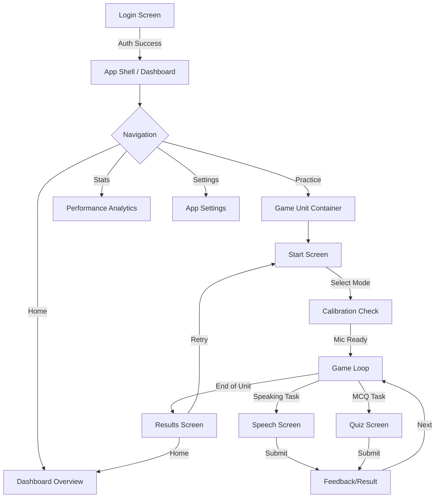

# Vocalis UI/UX Implementation Plan
**Version 1.0 | Target: Modern Glassmorphic Web App**

This document outlines the UI/UX overhaul for Vocalis. The goal is to create a premium, "wow-factor" interface while **strictly preserving** all existing speech analysis engines (Web Speech API, VAD, Levenshtein evaluation) and Redux state management.

---

## 1. Design System Foundation (Global)
**Theme**: Modern Glassmorphism with deep indigo brands.
*   **Background**: Interactive Vanta.js (Cells effect) or Neural Network particles on deep backgrounds.
*   **Cards**: White/Dark translucent glass (`backdrop-filter: blur(12px)`), rounded corners (`xl` or `2xl`), subtle borders.
*   **Typography**: `Inter` or `Outfit` (Google Fonts). Large, bold headings; clean, readable body text.
*   **Animations**: `Framer Motion` for all transitions. Smooth entry/exit, layout variations.
*   **Colors**:
    *   Primary: Indigo (`#6366F1` to `#4F46E5`)
    *   Success: Emerald (`#10B981`)
    *   Error: Rose (`#F43F5E`)
    *   Text: Slate (`#1E293B` / `#F8FAFC`)

---

## 2. User Flow Architecture

---

## 3. Screen Specifications

### A. Login / Auth Screen
*   **Goal**: Secure, impressive entry point.
*   **UI Layout**: Split Screen (Desktop) / Full Card (Mobile).
    *   *Left/Top*: Branding, Animated 3D/Vanta Background, slogan "Master your pronunciation".
    *   *Right/Bottom*: Clean form container (Email, Password, Social Logins).
*   **Key Components**:
    *   `VantaBackground` (Interactive canvas).
    *   Floating glass cards showing mock stats (e.g., "98% Accuracy").
    *   Input fields with floating labels and glow effects on focus.

### B. App Shell (Layout)
*   **Goal**: Persistent navigation and user state.
*   **UI Layout**:
    *   *Sidebar (Desktop)*: Collapsible, dark/light mode toggle, User profile at bottom.
    *   *Top Bar (Mobile)*: Hamburger menu, Logo centered.
*   **Features**:
    *   **Tech**: React Context (`AuthContext`) for user state.
    *   **ThemeToggle**: Toggles dark/light mode classes globally.

### C. Dashboard Overview (New)
*   **Goal**: Quick view of progress and daily streak.
*   **UI Elements**:
    *   **Greeting**: "Welcome back, [Name]".
    *   **Stats Grid**: Cards for "Total Practice Time", "Words Mastered", "Current Streak".
    *   **Recent Activity**: List of recently completed units with scores.
    *   **Action**: Large "Continue Learning" CTA button.

### D. Practice Unit (The "Game")
*This is the core existing functionality. It must run inside the App Shell.*

#### 1. Start Screen
*   **Goal**: Mode selection and tech capabilities showcase.
*   **Elements**:
    *   **Mode Cards**: "Mixed", "Speaking Only", "Quiz Only". Hover effects: Expand and glow.
    *   **Tech Specs Accordion**: "Industry-Standard Architecture" (LiveKit/Whisper description) - *Preserve exact text*.
    *   **Start Button**: Large, pulsing gradient button.

#### 2. Calibration / Mic Check
*   **Goal**: Ensure VAD and environment are ready.
*   **Functionality**:
    *   Run background noise check (1s).
    *   Calculate RMS threshold.
*   **UI**:
    *   Circular progress bar or waveform visualizing noise levels.
    *   Status text: "Listening to background noise...", "Ready".

#### 3. Game Screen (Speaking Task)
*   **Goal**: Pronunciation practice.
*   **Critical Tech**: `useSpeechRecognition` hook, VAD logic.
*   **UI Layout**:
    *   **Prompt Card**: Large text (e.g., "Janvier"). Phonetic helper below.
    *   **Visualizer**: `MicVisualizer` component. Must react to real-time volume/frequency.
    *   **Controls**: "Mic" button (Pulsing when listening).
    *   **Feedback Area**: Toast/Banner showing "Perfect!" or "Try again".
    *   **States**:
        *   *Idle*: Mic icon static.
        *   *Listening*: Waveform active, button pulsing.
        *   *Processing*: Spinner/Loader.
        *   *Result*: Green/Red glow border on card.

#### 4. Game Screen (MCQ Task)
*   **Goal**: Recognition testing.
*   **UI Layout**:
    *   Question Card.
    *   Grid of 3-4 Option Buttons.
    *   Animation: Staggered entrance for buttons. Confetti on correct answer.

#### 5. Results Screen
*   **Goal**: Session summary and gamification.
*   **UI Elements**:
    *   **Score Header**: Large percentage with conditional message ("Magnifique!").
    *   **Confetti**: `canvas-confetti` trigger on mount.
    *   **Detailed List**: Scrollable list of words. Icons for Correct/Partial/Wrong.
    *   **Action Buttons**: "Retry Unit" (Refresh), "Back to Dashboard".

### E. Settings Screen
*   **Goal**: User preferences.
*   **Options**:
    *   Audio Input Source selector.
    *   Sensitivity Slider (VAD Threshold).
    *   Theme selection.

### F. ASR Architecture Selection (Advanced Mode)
*   **Goal**: Allow users (or devs) to switch between speech recognition engines.
*   **Modes**:
    1.  **Native Client-Side (Default)**: Uses browser's Web Speech API. Fast, free, zero-latency. Best for Chrome/Android.
    2.  **Hybrid Cloud (Industry Standard)**:
        *   *Tech*: LiveKit (WebRTC) → Server → Whisper ASR.
        *   *Features*: "Production-proven approach". server-side VAD, noise gate.
        *   *Use Case*: Standard for iOS/Safari to prevent dropouts.
    3.  **Auto / Dynamic**: Automatically selects 'Hybrid' for iOS/Safari and 'Native' for Chrome/Desktop to optimize cost/performance.
*   **UI Implementation**:
    *   Toggle/Dropdown in Settings or "Tech Specs" accordion on Start Screen.
    *   When "Hybrid" is active, display the "Industry Standard Architecture" flow diagram/text.

---

## 4. Technical Constraints for UI Generation
When generating code for these screens, ensure the following hooks/props are connected:

1.  **Redux Integration**:
    *   All game state (score, index, history) MUST come from `useSelector(selectGameStatus)`, etc.
    *   Actions MUST be dispatched via `useDispatch()` (e.g., `submitResult`, `nextActivity`).
2.  **Audio Props**:
    *   `MicVisualizer` requires `stream` or `volume` data props.
    *   `GameScreen` must accept `startListening`, `stopListening`, `isListening` from the parent hook.
3.  **Responsiveness**:
    *   Mobile First: All tap targets > 44px.
    *   Use `Chakra UI` responsive props object: `w={{ base: "100%", md: "50%" }}`.

